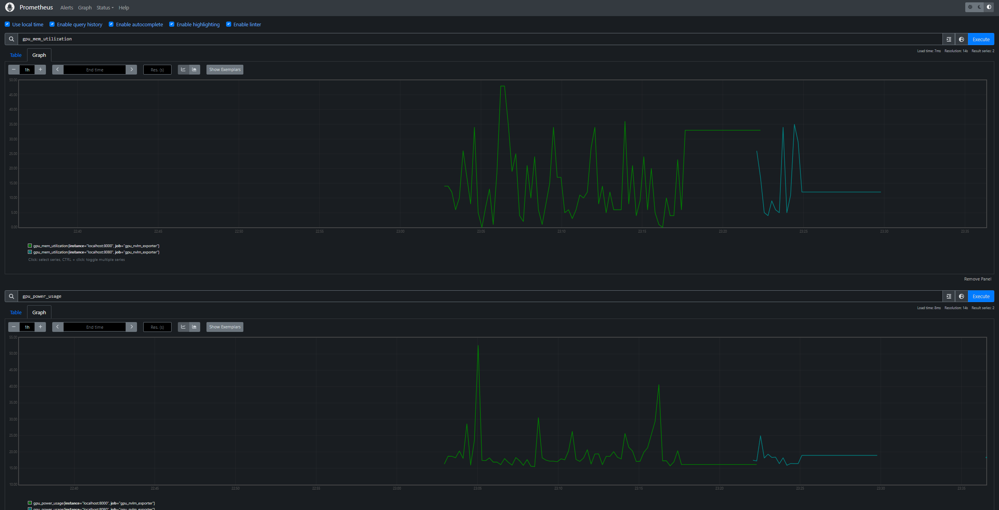

## Origin
This is the extended module of an original source: [https://github.com/nhan2892005/DOGES-BERT](https://github.com/nhan2892005/DOGES-BERT)

## Prerequisites
- NVIDIA drivers and NVML library
- `libmicrohttpd-dev`

## Build
Compile gpu_nvlm_exporter.c to then run as an HTTP endpoint at port 8000
```bash
gcc -o gpu_nvlm_exporter gpu_nvlm_exporter.c -lnvidia-ml -lmicrohttpd -lpthread
```

## Run
Run the Exporter
```bash
./gpu_nvlm_exporter
```

Assuming Prometheus is downloaded and extracted in the project folder
```bash
cd ~<folder including the prometheus source>
./prometheus --config.file=../prometheus.yml
```

## Monitor:
Open your local web browser:
```bash
http://localhost:9090
```
And select panels:
1. gpu_power_usage
2. gpu_temperature
3. gpu_utilization
4. gpu_mem_utilization


